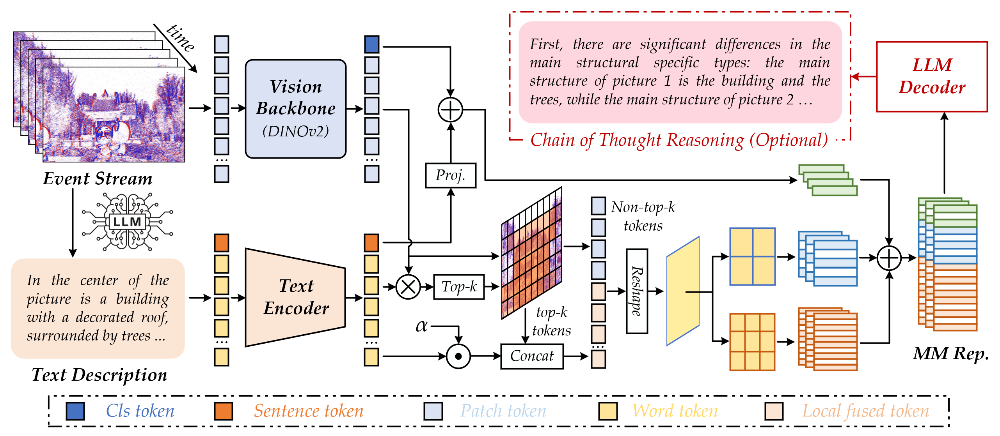

#  EPRBench

This is the official repository for the paper **"[EPRBench: A High-Quality Benchmark Dataset for Event Stream Based Visual Place Recognition](https://arxiv.org/abs/2602.12919)"**.

In this work, we propose **SGVPR** (Semantic-Guided Visual Place Recognition), a novel multi-modal fusion paradigm that leverages LLM-generated scene descriptions to guide spatially attentive token selection and cross-modal feature fusion.



## Abstract

Event stream-based Visual Place Recognition (VPR) is an emerging research direction that offers a compelling solution to the instability of conventional visible-light cameras under challenging conditions such as low illumination, overexposure, and high-speed motion. Recognizing the current scarcity of dedicated datasets in this domain, we introduce **EPRBench**, a high-quality benchmark specifically designed for event stream-based VPR. EPRBench comprises 10K event sequences and 65K event frames, collected using both handheld and vehicle-mounted setups to comprehensively capture real-world challenges across diverse viewpoints, weather conditions, and lighting scenarios.

To support semantic-aware and language-integrated VPR research, we provide LLM-generated scene descriptions, subsequently refined through human annotation. Furthermore, we propose a novel multi-modal fusion paradigm for VPR: leveraging LLMs to generate textual scene descriptions from raw event streams, which then guide spatially attentive token selection, cross-modal feature fusion, and multi-scale representation learning.


## Getting Started

### Prerequisites

- Python 3.9
- PyTorch (tested with 2.1.2+cu118)
- Other dependencies: `pip install -r requirements.txt`

### Dataset Preparation

You can download the **EPRBench** dataset from **[Baidu Netdisk](https://pan.baidu.com/s/15DzGOliRku07opgHjE8FXw?pwd=y9ii)**.

Please organize the dataset as follows:

```
/path/to/EventVPR/
├── train/
│   ├── database/
│   └── queries/
├── val/
│   ├── database/
│   └── queries/
├── test/
│   ├── database/
│   └── queries/
└── scene_descriptions/  # LLM-generated text descriptions (.txt files)
```


### Pre-trained Models

Download the pre-trained foundation model DINOv2 (ViT-B/14) [HERE](https://dl.fbaipublicfiles.com/dinov2/dinov2_vitb14/dinov2_vitb14_pretrain.pth).

## Training

To train the SGVPR model on the EPRBench (EventVPR) dataset:

```bash
python train.py --dataset_folder /path/to/EventVPR --foundation_model_path /path/to/dinov2_vitb14_pretrain.pth --text_folder /path/to/EventVPR/scene_descriptions --save_dir sgvpr_experiment --use_text --lambda_contrast 0.25 --temperature 0.07
```
Or simply run the script:

```bash
bash train.sh
```

## Evaluation

To evaluate the trained model on the EPRBench test set:

```bash
python eval.py --eval_datasets_folder /path/to/EventVPR --eval_dataset_name EventVPR --text_folder /path/to/OpenEventVPR/EventVPR/scene_descriptions --resume /path/to/best_model.pth --use_text
```
Or simply run the script:

```bash
bash eval.sh
```


## Trained Model

[Baidu Pan Link](https://pan.baidu.com/s/1jusc0c_2Pkn8Ii1G615yNg?pwd=9i7x)

## Citation

If you find this repo useful for your research, please consider citing our paper:

```bibtex
@article{wang2026eprbench,
  title={EPRBench: A High-Quality Benchmark Dataset for Event Stream Based Visual Place Recognition},
  author={Wang, Xiao and others},
  journal={arXiv preprint arXiv:2602.12919},
  year={2026}
}
```

## Acknowledgements

Parts of this repo are inspired by [CricaVPR](https://github.com/Lu-Feng/CricaVPR), and [DINOv2](https://github.com/facebookresearch/dinov2).
